<picture>
  
</picture>

---

> **[`> Orion`](https://github.com/kaushik0x7d2/orion)** &nbsp; `FHE` `PyTorch` `Go` `Security`
>
> Hardened FHE framework for private neural inference — 8 vulnerability fixes, 88 adversarial tests, transformer support, HuggingFace integration. Built on Orion (ASPLOS'25 Best Paper)

> **[`> VoxCrypt`](https://github.com/kaushik0x7d2/voxcrypt)** &nbsp; `FHE` `Voice Biometrics` `CKKS` `Privacy`
>
> End-to-end encrypted speaker verification using FHE — neural voice biometrics on fully encrypted audio, 100% FHE accuracy on LibriSpeech

> **[`> Athena`](https://github.com/kaushik0x7d2/athena-fhe)** &nbsp; `FHE` `PyTorch` `Polynomial Optimization`
>
> AI-driven polynomial discovery for FHE — learned degree-2 activation matches GELU on CIFAR-10 at depth 2, saving 3 FHE levels per inference

> **[`> PROTAC Pipeline`](https://github.com/kaushik0x7d2/protac-pipeline)** &nbsp; `Drug Discovery` `SE3` `Diffusion`
>
> Automated PROTAC drug design pipeline — SE3 equivariant diffusion models with data leakage analysis
